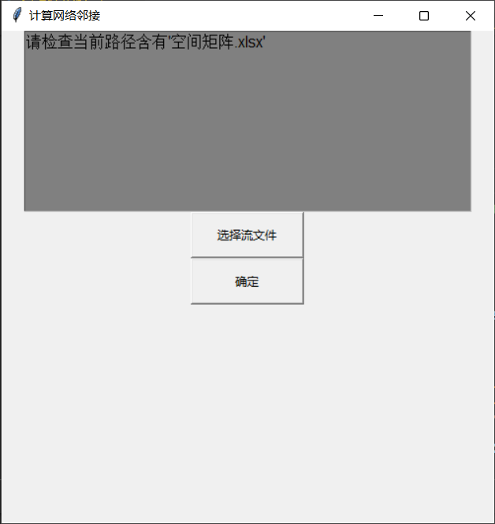
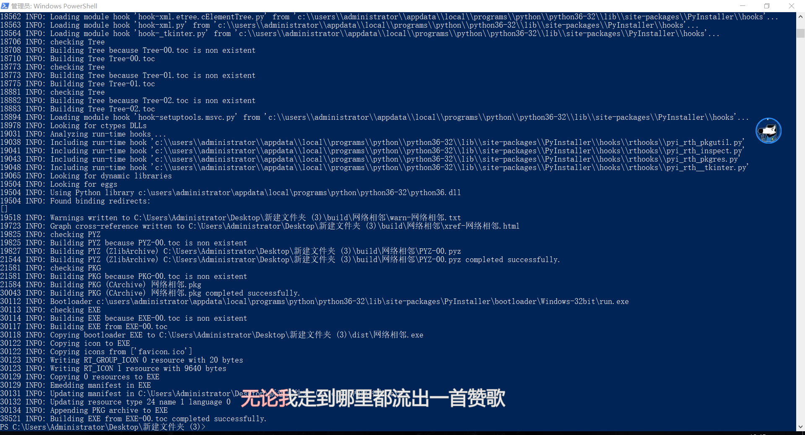

# Population-flow-model

人口预测模型的实现

在空间相关的模型下加入了时间相关矩阵，复现

> 一个空间邻接矩阵表（行政区的相邻）
>
> 一个流量表（行政区的流量）

## 界面

## 编译
> -F	显示命令行
>
> -i	图标
>
> --upx-dir	[UPX压缩](https://github.com/upx/upx/releases/tag/v3.96)

pyinstaller --clean -F -i  .\favicon.ico .\网络相邻.py --upx-dir=D:\env\upx-3.96-win64\upx.exe

